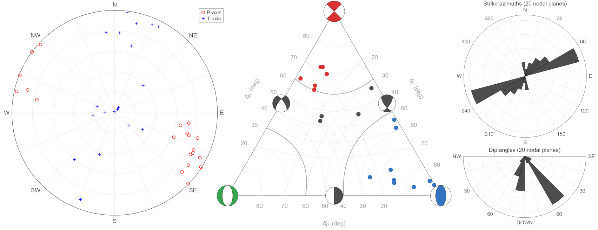

# Plot focal mechanism PT-axes into polar and triangle diagrams

Tools suite for double-couple seismic source analysis: Plot focal mechanism PT-axes into polar diagram, triangle diagram, and polar histograms of strike azimuths and dip angles.

The software is [citable](#9-cite-as) and archived on Zenodo.

---

This suite provides tools for the analysis and visualization of double-couple seismic 
sources. It processes Strike, Dip, and Rake angles to generate: 
1. **PT-axes** distributions in polar diagrams
2. **Triangle diagrams** (Frohlich, 1992) for focal mechanism classification
3. **Polar histograms** of strike azimuths and dip angles

These visualizations are essential for interpreting local seismotectonic settings 
and characterizing fault populations in seismic hazard assessment.

## 1 METHODOLOGY

The suite uses theory by Frohlich (1992) in the implementation by Hallo et al. (2019).

  Frohlich, C. (1992). Triangle diagrams: ternary graphs to display
similarity and diversity of earthquake focal mechanisms, Physics of the
Earth and Planetary Interiors, 75, 193-198. [https://doi.org/10.1016/0031-9201(92)90130-N](https://doi.org/10.1016/0031-9201(92)90130-N)

  Hallo, M., Oprsal, I., Asano, K., Gallovic, F. (2019). Seismotectonics
of the 2018 Northern Osaka M6.1 earthquake and its aftershocks: joint
movements on strike-slip and reverse faults in inland Japan, Earth,
Planets and Space, 71:34. [https://doi.org/10.1186/s40623-019-1016-8](https://doi.org/10.1186/s40623-019-1016-8)

## 2 TECHNICAL IMPLEMENTATION

*  Cross-Platform (Windows, Linux, macOS)
*  Portable Paths
*  Robust ASCII input parser
*  High-resolution image exports

## 3 PACKAGE CONTENT

1. `plot_pt_axes.m` - Plot PT-axes distributions in polar diagram
2. `plot_triangle.m` - Plot Triangle diagram for focal mechanism classification (strike-slip, reverse, normal, odd)
3. `plot_sdr_hist.m` - Plot polar histograms of strike azimuths and dip angles
4. `example_sdr.txt` - Example of input text file with Strike, Dip, and Rake angles

## 4 RELEASE HISTORY (MAJOR VERSIONS)

*   **2.0 — Refactored Release** | April 2026
    *   Modernization: Fully ported to MATLAB R2025b with industry-standard directory structure
    *   UX/I-O: Robust ASCII parser, intuitive variable naming, and refined graphical reports

*   **1.0 — Initial Release** | February 2019
    *   Core implementation used by paper published in Earth, Planets and Space (Hallo et al., 2019)

## 5 REQUIREMENTS

  MATLAB: Version R2025b or newer, Codes do not require any additional Matlab Toolboxes

## 6 USAGE

1. Prepare your `example_sdr.txt` input file (Strike, Dip, and Rake angles)
2. Open MATLAB
3. Run any of the main scripts: `plot_pt_axes.m`, `plot_triangle.m`, or `plot_sdr_hist.m`
4. Check the `/results` folder for high-resolution outputs

## 7 EXAMPLE OUTPUT

This tool suite features a robust ASCII text parser to read Strike, Dip, and Rake angles.
It automatically processes the data, generates professional visualizations,
and saves the results in high-resolution formats.

<picture>
  <source media="(prefers-color-scheme: dark)" srcset="img/pt_plots_dark.png">
  <source media="(prefers-color-scheme: light)" srcset="img/pt_plots_light.png">
  
</picture>

## 8 COPYRIGHT

Copyright (C) 2018,2019,2026 Miroslav Hallo

This program is published under the GNU General Public License (GNU GPL).

This program is free software: you can modify it and/or redistribute it
or any derivative version under the terms of the GNU General Public
License as published by the Free Software Foundation, either version 3
of the License, or (at your option) any later version.

This code is distributed in the hope that it will be useful, but WITHOUT
ANY WARRANTY. We would like to kindly ask you to acknowledge the authors
and don't remove their names from the code.

You should have received a copy of the GNU General Public License along
with this program. If not, see <http://www.gnu.org/licenses/>.

## 9 CITE AS

If you use this tools suite, please cite both the original methodology paper (preferred) and the software version as follows:

### For the methodology and implementation:
> Hallo, M., Oprsal, I., Asano, K., Gallovic, F. (2019). Seismotectonics of the 2018 Northern Osaka M6.1 earthquake and its aftershocks: joint movements on strike-slip and reverse faults in inland Japan. Earth, Planets and Space, 71:34. [https://doi.org/10.1186/s40623-019-1016-8](https://doi.org/10.1186/s40623-019-1016-8)

### For the specific software version:
> Hallo, M. (2026). Tools suite for seismic source analysis: Polar PT-axes and triangle diagrams (v2.1.1) [Software]. Zenodo. [https://doi.org/10.5281/zenodo.19342842](https://doi.org/10.5281/zenodo.19342842)
